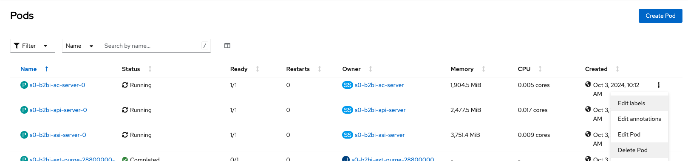
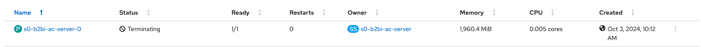
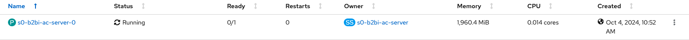

# Containerized Sterling B2Bi Lab - Day 2

## **0. Check on Sterling B2Bi installation**
In this section of the lab, we check on the Sterling B2Bi installation that it completed successfully.

0.1 (login to Openshift)

0.2 (look at the different namespaces/projects - db2, mq, b2bi - that were deployed)

0.3 (go to db2 and mq namespaces one at a time and look at running pods, services for each)

0.4 (go to b2bi namespace and show running pods, secrets (show db credentials), services, routes)

0.5 (in routes, click on b2bi route to bring it up on browser)

---

## **1. Log into Containerized Sterling B2Bi**
In this section of the lab, we will log in to Sterling B2Bi to access the application. 

1.1. To access B2Bi, login to your cluster with your user credentials by browsing to the 'OpenShift web console'.

1.2. From the administrator section menu on the left, click on the 'Networking' drop down menu and click on 'Routes', and at the top of the dashboard, select the 'sterling-b2bi-dev01-app' project. 


1.3. Search for 'dashboard' in the filtering options. Select the location url to access the Sterling B2Bi dashboard.


1.4. Log in to Sterling B2Bi using the provided credentials.
      
      username = admin
      password = password


### Verify running version of Sterling B2B Integrator

1.5. Navigate to the Support page, indicated by the  icon. 


1.6. Navigate to the bottom of the screen to identify the version of running version of Sterling B2Bi. 


---

## **2. Create and Execute a Business Process**
In this section of the lab, we will create and execute a sample business process in Sterling B2Bi.

### Import a Sample Business Process in Sterling B2Bi  
2.1. From the administration menu on the left, click the 'Deployment' drop down menu and click on the 'Resource Manager' drop down to select 'Import/Export'.


2.2. Next to 'Import Resources', select the 'Go!' icon. 


2.3. Import the 'Sample-BP-Demo-B2Bi-Import.xml' file into Sterling B2Bi to import the sample business process. 

      Passphrase = password 


2.4. Select default options and finalize the import by selecting 'Finish' to complete the import of the new business process in Sterling B2Bi. 


### Execute the Sterling B2Bi Business Process with Sample Data 

2.5 From the administration section menu on the left, click the 'Business Processes' drop down menu and select 'Manager'. 


2.6. Search for the Process Name 'Sample-BP-Demo' and select the 'Go!' icon to locate the business process. 


2.7. Once directed to the next page, click on the green 'Execution Manager' icon.


2.7. Once directed to the next page, click on the green 'Execute' icon, to execute the sample business process in Sterling B2Bi.


2.8. Upload the sample data file 'Sample-Data' and select 'Go!' to execute the business process using the sample data. 


2.9. Review the execution of the sample business process. Once the processing is complete, B2Bi will indicate a status of 'Success'. 


---

## **3. Self-heal**
In this section of the lab, we see how RedHat OpenShift performs self healing when a pod is deleted. 

3.1. To delete the pod, login to your cluster with your user credentials by browsing to the `OpenShift web console`.  

3.2. From the administrator section menu on the left, clink on the `Workload` drop down menu and click on Pods, and at the top, select the `sterling-b2bi-dev01-app` project.  

3.3. Select one of the `s0-b2bi` pods to delete and end of the row, click the vertical dot menu and click delete. 


      
After the pod is deleted, the pod is reinstantiated and processing work as part of the deployed Sterling B2B Integrator cluster.

    >💡 **NOTE**     
    > While the pod is being terminated a new pod is being created.
    > If you delete on one of the pods or it crashes Openshift will automatically create a new pod to replace the problem pod
      


      


---

## **4. Automatically Scale a Pod**
In this section of the lab, we see how Horizontal Pod Autoscaling works in the OpenShift cluster.  We will see how the Sterling B2B Integrator instance dynamically scales based on the load on the system.  For this lab we will simulate the load on the system by modifing the deployment paramaters via the GitOps repo. Sterling B2B Integrator can scale up and down manually or automatically.

The deployments settings below affect the load, which are the number of pods and the CPU usage. 

### Increase the Relicca to 2 and Enable Autoscaling
Before we change the settings to simulate the load,  we will increse the relicca to 2 and enable autoscaling.  Follow the steps below:

4.1.

  ```bash
  cd ~/$GIT_ORG/multi-tenancy-gitops-services/instances/ibm-sfg-b2bi
  ```
4.2. Inside `values.yaml`, find & set the `replicaCount` and `enabled` fields for both the `asi` and `ac` Sterling componets:

  ```yaml
  ibm-sfg-prod:
    ....
    asi:
      replicaCount: 1     <--- change to 2
      ....
      autoscaling:
        enabled: false    <----change to true
        minReplicas: 2
        maxReplicas: 4
        targetCPUUtilizationPercentage: 60
  ```
  ```yaml
  ibm-sfg-prod:
    ....
    ac:
      replicaCount: 1     <--- change to 2
      ....
      autoscaling:
        enabled: false    <----change to true
        minReplicas: 2
        maxReplicas: 4
        targetCPUUtilizationPercentage: 60
  ```
      
4.3. Now deploy the changes by committing and pushing the changes to your `multi-tenancy-gitops-services` repository:
```bash
#change to the `multi-tenancy-gitops-services` directory
cd ~/$GIT_ORG/multi-tenancy-gitops-services

# Verify the changes, and add the files that have been changed
git status
git add -u
 
# Finally commit and push the changes
git commit -m "increase replicas and enable auto scaling"
git push
# Input your github username when prompted for Username
# Input the Github Token that you had created earlier when prompted for Password
```

4.4. Sync the changes in Argo  via the `ibm-sfg-b2bi-prod` argo application

### Simulate a Load on the System to Trigger Pod Autoscaling
Now, to simulate a load on the system so that we trigger the auto scaling of pods, we will lower the target CPU utiliziation by modifying the `values.yaml` file in GitOps repo.    Follow the steps below:

4.5. 
  ```bash
  cd ~/$GIT_ORG/multi-tenancy-gitops-services/instances/ibm-sfg-b2bi
  ```
4.6. Inside `values.yaml`, find & set the `replicaCount` and `enabled` fields for both the `asi` and `ac` Sterling componets:

  ```yaml
  ibm-sfg-prod:
    ....
    asi:
      replicaCount: 2   
      ....
      autoscaling:
        enabled: true  
        minReplicas: 2
        maxReplicas: 4
        targetCPUUtilizationPercentage: 60    <----change to 20
  ```
  ```yaml
  ibm-sfg-prod:
    ....
    ac:
      replicaCount: 2 
      ....
      autoscaling:
        enabled: true  
        minReplicas: 2
        maxReplicas: 4
        targetCPUUtilizationPercentage: 60    <----change to 20
  ```
      
4.7. Now deploy the changes by committing and pushing the changes to your `multi-tenancy-gitops-services` repository:
```bash
#change to the `multi-tenancy-gitops-services` directory
cd ~/$GIT_ORG/multi-tenancy-gitops-services

# Verify the changes, and add the files that have been changed
git status
git add -u
 
# Finally commit and push the changes
git commit -m "lower the target CPU utlization to simulate load."
git push
# Input your github username when prompted for Username
# Input the Github Token that you had created earlier when prompted for Password
```

4.8. Sync the changes in Argo via the `ibm-sfg-b2bi-prod` argo application

4.9. Now go to the Redhat Openshift Console and observe the number of pods for the `asi` and `ac` Sterling componets. If a pod starts using more than 20% of the allocated CPU the autoscaler is going to spin up a new pod.
    
   
   
  
4.10. Next, go to the Openshift console and on the left go to the drop down and search under HorizontalPodAutoscaler, you will see the new `asi` and `ac` autoscalers.

---

## **5. Upgrade/Roll Back**
In this section of the lab, we see how you can upgrade and roll back versions using the GitOps method.

Using the GitOps method we see how the upgrade process is shorten.  We are also able to roll back to previous version if there is an issue.  The GitOps method also provides for traceability as to when and who made the change in the commit record in GitHub.

5.1. To upgrade the version, first go to the IBM Sterling Console application and check the current version, which is version `6.1.0.0`. 


5.2. Now go update the `values.yaml` file in your repo as follows:

```bash
cd ~/$GIT_ORG/multi-tenancy-gitops-services/instances/ibm-sfg-b2bi
```

5.3.  Inside `values.yaml`, find & set the tag from `6.2.0.2` to `6.2.0.3`
```yaml
ibm-sfg-prod:
global:
image:
  repository: cp.icr.io/cp/ibm-sfg/sfg
  tag: 6.2.0.2                           <----change to 6.2.0.3       
```

5.4. Now deploy the changes by committing and pushing the changes to your `multi-tenancy-gitops-services` repository:
```bash
#change to the `multi-tenancy-gitops-services` directory
cd ~/$GIT_ORG/multi-tenancy-gitops-services

# Verify the changes, and add the files that have been changed
git status
git add -u
 
# Finally commit and push the changes
git commit -m "update to version 6.1.0.1"
git push
# Input your github username when prompted for Username
# Input the Github Token that you had created earlier when prompted for Password
```
5.5. Sync the changes in Argo  via the `ibm-sfg-b2bi-prod` argo application. Argocd will detect these changes and create a new pod with the latest version.

  
        
  

5.6. To verify the version, simply go to the Sterling app menu and click on the support button in the Sterling Console.**  


---

## **6. Log back into upgraded version of Sterling**

6.1. Log in to Sterling B2Bi using the provided credentials.
      
      username = admin
      password = password


### Verify running version of Sterling B2B Integrator

6.2. Navigate to the Support page, indicated by the  icon. 


6.3. Navigate to the bottom of the screen to identify the upgraded version of Sterling B2Bi. 


---


